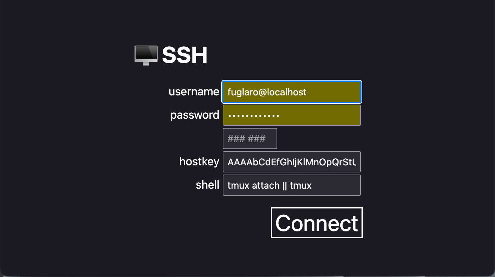

#  WebShush

The whisper thin SSH portal for terminal access in your browser!

| <!-- --> | <!-- --> |
|----|----|
|  |  |

## Features
* 👤 Simple login screen.
* 🖥 Launch shell customizations.
* 🔗Support for session reconnection (set shell to `tmux attach || tmux`).
* 📌 Automatic connection parameter saving (into the URL for bookmarking).
* 💻 Host and port specifiers (defaulting to localhost and port 22).
* 🤓 Nerd Font icons (Noto Mono Nerd Font).
* 🎨 Beautiful Alacritty color theme.
* 🖍️ Double Click, Triple Click, Shift+Drag and Shift+Alt+Drag selection controls.
* 📋 Intuitive copy and paste controls, in harmony with sending interrupts.
* 💪 Hardened security.
* 🔑 Supports Strict Host Key Checking.
* 🔒 Authentication via SSH user account credentials, with optional support for 2FA.
* 🔏 Compatible with browser credentials management.
* 🎁 Self contained single-file executable.
* 🌏 Access from Firefox, Safari, Chrome, and other Chromium based browsers.
* 🐎 Lightweight and fast.

### Build
* Ensure you have golang on your mac or linux machine.
* Add remaining dependencies and build:
```bash
./build
```
You can also create fully self contained executables for all supported platforms
with `./build release`.

### Install
* Ensure your machine allows ssh from localhost.
* Setup a certficate for TLS and ensure your browser respects it.
* Start server:
```bash
WEBSHUSH_CERT_FILE=my.crt WEBSHUSH_KEY_FILE=my.key ./webshush
```
* Open in your browser. Eg: `https://localhost/`

### Certificate
If you don't have your own domain, you can set up TLS using a Self Signed Certificate with tools such as minica or openssl.

E.g, for testing locally:
```bash
openssl req -x509 -newkey rsa:4096 -sha256 -days 1 -nodes -keyout my.key -out my.crt -subj "/CN=localhost" -addext "subjectAltName=DNS:localhost,IP:127.0.0.1"
```

### Launch Options
Supported environment variables:
* `WEBSHUSH_CERT_FILE` & `WEBSHUSH_KEY_FILE`: The credentials to use for TLS connections.
* `WEBSHUSH_DOMAIN`: The domain to use with the included Let's Encrypt integration. Use of this implies acceptance of the LetsEncrypt Terms of Service.
* `WEBSHUSH_LISTEN`: The address to listen on. Defaults to ':443'.
* `WEBSHUSH_SSH_PORT`: The port to use to connect locally.

## Design
This design for this solution favors simplicity and minimalism, both inside and out,
without losing powerful features.
It is a joy to use because it does what it needs to, reliably and quickly,
and then gets out of the way.
The primary design philosophy for this project is: **"complexity must justify itself, ruthlessly"**.


### Internals
The code is organised across a minimal number files as a result of a heavily opinionated focus
on simplicity through reducing the complexities of code interconnectivity:
* [main.go](main.go) - the primary server.
* [resources/main.html](resources/main.html) - the main frontend browser page.

No frontend framework is used because adopting one on top of the simple interface design
would have introduced unjustified complexity.

### Security
Since this service proxies SSH credentials, hardened security policies have been implemented.
Please use a modern up-to-date browser and device to make full use of these protections.
These policies enables hardened web security between the browser and the server,
then falling back to SSH security between the server and the SSH host.
Please ensure you use a trusted connection between the server and the SSH client,
or ensure you use a trusted SSH host certificate.

For full details, see [SECURITY.md](SECURITY.md).

Disclaimer: Use at your own risk. The codebase is strikingly small and the dependencies few,
so the aim is that a security audit, for whosoever wishes to do it, should be as easy as possible.
Nothing is secure until it is audited and reviewed by peers.

# Wish List for Future Work
* Support remote terminal commands sending clipboard events (ANSI OSC 52 support) - due in xtermjs 6.0.0 milestone (https://github.com/xtermjs/xterm.js/issues/3260).
* Kitty Control Sequence Protocol xtermjs addon (https://sw.kovidgoyal.net/kitty/keyboard-protocol).
* Electron app builds.

# Thanks to
We stand on the shoulders of giants. They own this, far more than I do.
* https://xtermjs.org/
* https://github.com/huashengdun/webssh
* https://github.com/fuglaro/filet-cloud
* https://developer.mozilla.org/
* https://github.com/pkg/sftp
* https://github.com/gorilla/websocket
* https://golang.org/
* https://github.com/golang/crypto
* https://github.com/
* https://www.theregister.com
* https://www.nature.com/articles/s41586-021-03380-y
* https://www.jsdelivr.com/
* https://github.com/AlDanial/cloc
* a world of countless open source contributors.
